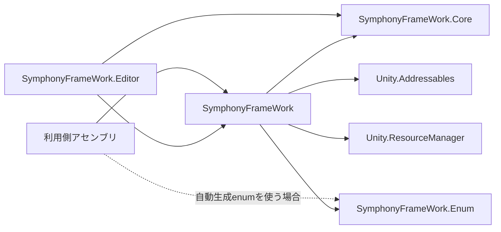
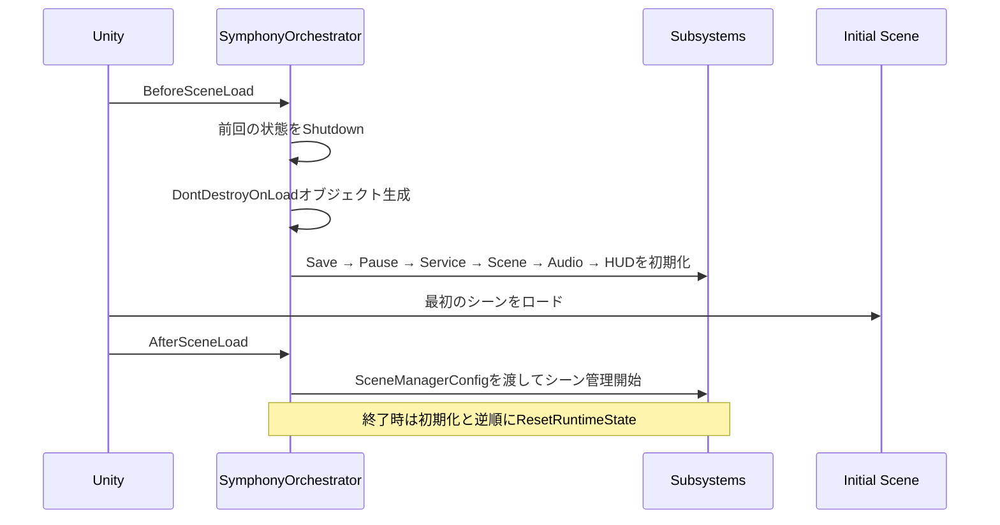
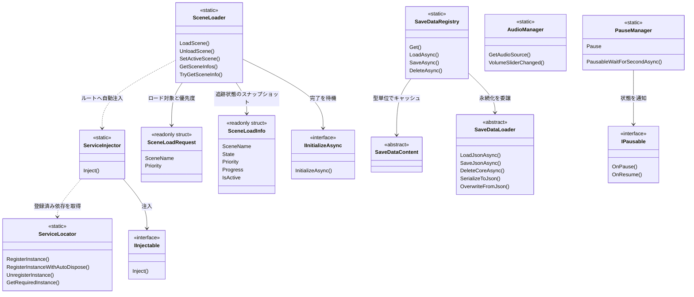
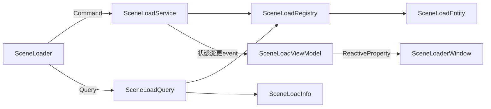
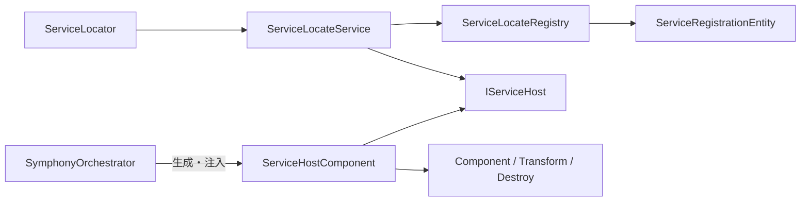
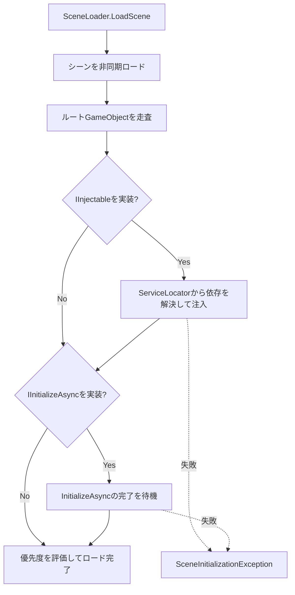

# Symphony Frameworkの構成

この文書は、パッケージ内を移動するときや、公開型どうしの関係を確認するときの構成図です。APIの使用例は[README.md](../README.md)、AIエージェント向けの判断ルールは[AgentUsage.md](./AgentUsage.md)を参照してください。

## アセンブリ



- `SymphonyFrameWork`: Runtime API、Component、設定型、Utilityを含むメインアセンブリ。
- `SymphonyFrameWork.Core`: RuntimeとEditorが共有する定数・基盤。利用側が通常直接参照する必要はない。
- `SymphonyFrameWork.Editor`: Editor専用の設定画面、管理ウィンドウ、Drawer、Generator。Playerビルドには含まれない。
- `SymphonyFrameWork.Enum`: 利用プロジェクトのScene、Tag、Layer、Audio Groupから生成されるアセンブリ。利用する場合だけ消費者側asmdefから参照する。

参照方向は`Editor → Runtime → Core`です。RuntimeまたはCoreからEditorへ逆参照しません。

## パッケージのディレクトリ

```text
SymphonyFrameWork/
├─ Core/                    Runtime／Editor共通の定数と基盤
│  └─ Internal/            パッケージ内部だけで使う実装
├─ Runtime/                 Playerビルドへ含まれる機能
│  ├─ Attribute/           Inspector属性
│  ├─ Component/           GameObjectへ追加するComponent
│  ├─ Configs/             設定の検索とinternal設定型
│  ├─ Debug/               HUD、Logger、StopWatch
│  ├─ Interface/           注入・初期化などの公開契約
│  ├─ Orchestrator/        自動初期化を行うComposition Root
│  ├─ System/              Scene、Service、Save、Audio、Pause
│  └─ Utility/             Awaitable、Tween、文字列等の補助
├─ Editor/                  Editor専用UI、Drawer、Generator
├─ Samples/Runtime/         Package Managerから導入する利用例
├─ Tests/                   EditMode／PlayModeテスト
└─ Documentation~/         Asset Importされない利用者向け詳細文書
```

各機能の`Internal/`は公開APIではありません。利用側コードとSampleは`Internal/`の型へ依存しません。

## 起動と終了

`SymphonyOrchestrator`がComposition Rootです。利用側でBootstrapを作る必要はありません。



Play ModeのDomain Reloadが無効でも状態を持ち越さないよう、開始時に既存状態を破棄し、終了時は初期化済みサブシステムを逆順で解放します。

## 公開Facadeと拡張点



Facadeは利用側の入口、interfaceと抽象classは利用側が実装する拡張点です。ConfigとManagerの内部実装はFacadeの背後に隠し、利用側へ公開しません。

Scene Loadの内部では、Commandと読み取りを分離しています。



`SceneLoadQuery`だけがRegistry／Entityを読み取り、利用側には`SceneLoadInfo`、Viewには内部Dtoを返します。`SceneLoaderWindow`はViewModelを購読し、RuntimeのRegistryやEntityを直接参照しません。

Service LocateのRuntime内部では、登録単位、処理順、Unity所有処理を分離しています。



通常登録が型重複で失敗しても候補payloadを解放しません。`RegisterInstanceWithAutoDispose`を選んだ場合だけ、失敗した候補を`ServiceHostComponent`が`IDisposable`またはComponentとして解放します。RegistryとEntityはUnity APIを参照しません。

## シーンロード時の連携



この連携が必要なシーンではUnity標準の`SceneManager.LoadScene`を直接使わず、`SceneLoader`を入口にします。
