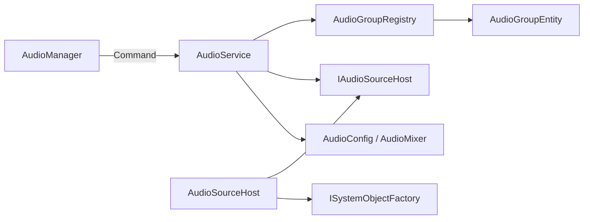

# Audio Manager

AudioMixerのグループごとにAudioSourceを管理し、音量を変更します。

## 入口

| 項目 | 内容 |
| --- | --- |
| namespace | `SymphonyFrameWork.System` |
| 主な公開型 | `AudioManager` |
| メニューパス | なし |
| 設定の保存先 | `Assets/Resources/SymphonyFrameWork/AudioConfig.asset` |

## クイックスタート

`AudioConfig.asset`へAudioMixerとグループを登録すると、グループ名からAudioSourceを取得できます。

```csharp
using SymphonyFrameWork.System;
using UnityEngine;

AudioSource bgm = AudioManager.GetAudioSource("BGM");
bgm.clip = bgmClip;
bgm.Play();

AudioManager.VolumeSliderChanged("BGM", 0.5f);
```

AudioSourceはグループごとに必要になった時点で生成され、シーン遷移後も保持されます。音量は0〜1の比率で指定します。

## 実装時の注意

- `GetAudioSource`で使うグループ名が`AudioConfig.asset`へ登録済みか確認する。
- `VolumeSliderChanged`へ渡す値はdBではなく0〜1の比率。

## 内部構造

Audioは読み取り経路の利用者（Editor WindowとMCP診断）が無いため、QueryとViewModelを持ちません。



`AudioSourceHost`は**最初にAudioSourceを求められた時点で初めてGameObjectを生成します。** AudioMixerが未割り当てなどでAudioSourceを1つも作らない場合、GameObjectも作られません。

## 関連

- [Architecture.md](../Architecture.md)
- [Deprecations.md](../Deprecations.md)
- [CHANGELOG.md](../../CHANGELOG.md)
