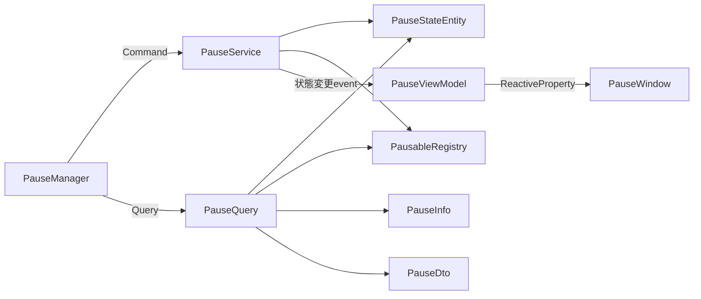

# Pause Manager

ゲーム全体のポーズ状態を切り替え、通知やポーズ対応の待機処理を利用できます。

## 入口

| 項目 | 内容 |
| --- | --- |
| namespace | `SymphonyFrameWork.System` |
| 主な公開型 | `PauseManager` / `IPausable` |
| メニューパス | `Window > SymphonyFrameWork > Symphony Administrator` の `Pause` パネル |
| 設定の保存先 | なし |

## クイックスタート

```csharp
using SymphonyFrameWork.System;

private void OnEnable()
{
    PauseManager.OnPauseChanged += HandlePauseChanged;
}

private void OnDisable()
{
    PauseManager.OnPauseChanged -= HandlePauseChanged;
}

private void HandlePauseChanged(bool paused)
{
    // UI更新など
}

public void SetPaused(bool paused)
{
    PauseManager.Pause = paused;
}

private async void RunAfterOneActiveSecond()
{
    await PauseManager.PausableWaitForSecondAsync(1.0f, destroyCancellationToken);
    // ポーズ時間を除く1秒後の処理
}
```

Coroutine、非同期処理、遅延Destroy、遅延Invoke、Tweenをポーズへ追従させられます。オブジェクト単位の通知には`PauseManager.IPausable`を実装します。

## 実装時の注意

- ポーズ中も止める待機には`PausableWaitForSecondAsync`、`PausableWaitForSecond`、`PausableNextFrameAsync`を使う。`Task.Delay`や通常の`WaitForSeconds`では代用しない。
- **非同期の待機APIは`Awaitable`を返す。** `Awaitable`は1回しか`await`できず、保存も共有もできない。フィールドへ持たず、その場で待機する。複数待機は`SymphonyAwaitable.WhenAll`、`Task`と混ぜる場合は`SymphonyAwaitable.AsTask`を使う。
- `PauseManager.IPausable`は有効化時に登録し、無効化時に解除する。同じ対象を重複登録しても通知は1回だけ届く。
- **`OnPauseChanged`は値が変わったときだけ発行される。** `Pause = true`を2回続けても`IPausable.Pause()`は1回しか呼ばれない。同じ値の再設定を通知の起点にしない。
- ポーズ状態と`IPausable`の購読件数をまとめて調べる場合は`PauseManager.GetPauseInfo()`を使い、戻る`PauseInfo`を取得時点のスナップショットとして扱う。購読件数は解除し忘れの検出に使える。
- `OnPauseChanged`の購読者が投げた例外は握り潰されず、`Pause`を設定した側へ伝播する。購読側で処理する。

## Editor機能

**入口**: `Window > SymphonyFrameWork > Symphony Administrator`

| パネル | 内容 |
| --- | --- |
| Pause | ポーズ状態の確認と切り替え |

Play Mode中のみ内容を持ちます。Edit Modeでは未接続状態を表示します。

## 内部構造

Pauseも同じ形で、状態の保持、購読の管理、表示状態を分離しています。



`PauseStateEntity`が「状態が実際に変化したか」を判定するため、同じ値の再設定では`OnPauseChanged`を発行しません。

`OnPauseChanged`（利用側が購読する公開event）の購読者例外は握りません。`OnStateChanged`（表示専用）だけは発行側で捕捉してログへ出し、ViewModelの失敗をゲーム側のポーズ処理へ波及させません。

## 関連

- [Utility](./Utility.md)
- [Architecture.md](../Architecture.md)
- [Deprecations.md](../Deprecations.md)
- [CHANGELOG.md](../../CHANGELOG.md)
