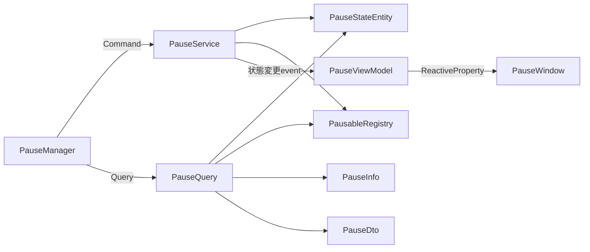

# Pause Manager

**カテゴリーごとにポーズ状態を切り替え**、通知やポーズ対応の待機処理を利用できます。「UIは動かしたままゲームプレイだけ止める」といった分け方ができます。

## 入口

| 項目 | 内容 |
| --- | --- |
| namespace | `SymphonyFrameWork.System` |
| 主な公開型 | `PauseManager` / `IPausable` / `PauseInfo` |
| メニューパス | `Window > SymphonyFrameWork > Symphony Administrator` の `Pause` パネル |
| 設定の保存先 | `Project Settings > SymphonyFrameWork > Pause Category`（カテゴリー名の登録） |

## クイックスタート

**カテゴリーは`PauseManager.IPausable`を継承した空のinterfaceで表します。** 手で書いても、`Project Settings > SymphonyFrameWork > Pause Category` から生成しても構いません。

```csharp
using SymphonyFrameWork.System;

// カテゴリーの定義。空のinterfaceでよい
public interface IGameplayPausable : PauseManager.IPausable { }
public interface IUiPausable : PauseManager.IPausable { }
```

止めたい対象は、属したいカテゴリーを実装します。

```csharp
public sealed class Enemy : MonoBehaviour, IGameplayPausable
{
    private void OnEnable() => PauseManager.IPausable.RegisterPauseManager(this);
    private void OnDisable() => PauseManager.IPausable.UnregisterPauseManager(this);

    public void Pause() { /* 停止処理 */ }
    public void Resume() { /* 再開処理 */ }
}
```

操作と購読は型パラメータで行います。

```csharp
// このカテゴリーの対象だけが止まる。UIは動き続ける
PauseManager.SetPause<IGameplayPausable>(true);
bool paused = PauseManager.IsPaused<IGameplayPausable>();

// 全部止める・どれか1つでも止まっているか
PauseManager.SetPauseAll(true);
bool anyPaused = PauseManager.IsPausedAny();

// 通知の購読。**eventは型パラメータを持てないためメソッドで受け取る**
PauseManager.AddPauseChangedHandler<IGameplayPausable>(HandlePauseChanged);
PauseManager.RemovePauseChangedHandler<IGameplayPausable>(HandlePauseChanged);

// 待機もカテゴリーを指定する
await PauseManager.PausableWaitForSecondAsync<IGameplayPausable>(1.0f, destroyCancellationToken);
```

Coroutine、非同期処理、遅延Destroy、遅延Invoke、Tweenをポーズへ追従させられます。

### 複数のカテゴリーに属する場合

**どれか1つでもポーズなら`Pause()`が呼ばれ、すべて解除されたときだけ`Resume()`が呼ばれます。** 対象ごとに停止要因の数を持っているため、2つ止めて片方だけ解除しても再開しません。

派生カテゴリーを実装した対象は、基底カテゴリーにも属します。基底を止めれば派生の対象も止まります。

### カテゴリーを指定しない場合

`PauseManager.IPausable`を直接実装した対象は、**既定カテゴリー**に属します。`SetPauseAll`でも`SetPause<PauseManager.IPausable>`でも止まります。どのカテゴリーにも属さず絶対に止まらない対象は生まれません。

### 旧APIからの移行

カテゴリーを指定しない`Pause`、`OnPauseChanged`、待機系6件は**非推奨**です。削除はしておらず、「どれか1つでもポーズ中か」を見て従来どおり動きます。移行先は[Deprecations.md](../Deprecations.md)にあります。

## 実装時の注意

- ポーズ中も止める待機には`PausableWaitForSecondAsync`、`PausableWaitForSecond`、`PausableNextFrameAsync`を使う。`Task.Delay`や通常の`WaitForSeconds`では代用しない。
- **非同期の待機APIは`Awaitable`を返す。** `Awaitable`は1回しか`await`できず、保存も共有もできない。フィールドへ持たず、その場で待機する。複数待機は`SymphonyAwaitable.WhenAll`、`Task`と混ぜる場合は`SymphonyAwaitable.AsTask`を使う。
- `PauseManager.IPausable`は有効化時に登録し、無効化時に解除する。同じ対象を重複登録しても通知は1回だけ届く。**属するカテゴリーは実装しているinterfaceから自動で決まる**ため、登録時にカテゴリーを渡す必要はない。
- **通知は値が変わったときだけ発行される。** 同じ値を2回設定しても`IPausable.Pause()`は1回しか呼ばれない。同じ値の再設定を通知の起点にしない。
- **`SetPause<TCategory>`の型引数はinterfaceでなければならない。** 型制約`where TCategory : IPausable`は`IPausable`を実装した具象クラスも通してしまうため、具象型を渡すと`ArgumentException`になる。
- **ポーズ中に登録した対象は、さかのぼって停止しない。** 登録時点では`Pause()`が呼ばれず、解除されたときに`Resume()`が届く。
- カテゴリー単位の状態と件数は`PauseManager.GetPauseInfo<TCategory>()`で調べる。全体は`GetPauseInfo()`で、この場合`PauseInfo.Category`は`null`になる。いずれも取得時点のスナップショットとして扱う。購読件数は解除し忘れの検出に使える。
- 通知の購読者が投げた例外は握り潰されず、状態を設定した側へ伝播する。購読側で処理する。

## Editor機能

**入口**: `Window > SymphonyFrameWork > Symphony Administrator`

| パネル | 内容 |
| --- | --- |
| Pause | 全体のポーズ状態の確認と切り替え、`IPausable`の購読件数 |
| Pause > Categories | **カテゴリーごとのポーズ状態と、属する対象の件数。** 表示名の昇順で並ぶ |

Play Mode中のみ内容を持ちます。Edit Modeでは未接続状態を表示します。

### ポーズカテゴリーの生成

**入口**: `Project Settings > SymphonyFrameWork > Pause Category`

カテゴリー名を登録して「設定を保存してinterfaceを生成」を押すと、`Assets/Scripts/SymphonyFrameWork/PauseCategory/` へ `PauseManager.IPausable` を継承した空のinterfaceを生成します。**設定した名前は `I` と `Pausable` で挟まれます**（`Gameplay` → `IGameplayPausable`）。生成される名前は入力欄の隣にその場で表示されます。

| 規則 | 内容 |
| --- | --- |
| 生成先 | `Assets/Scripts/SymphonyFrameWork/PauseCategory/`。専用の `SymphonyFrameWork.PauseCategory` アセンブリを作り、`SymphonyFrameWork` を参照します |
| 名前 | C#の識別子として使えない名前は除外し、警告を出します。同じinterface名になる候補は1件だけ残します |
| 削除 | **設定から消してもファイルは削除しません。** 実装しているコードがある場合に黙って消すとコンパイルが壊れるためです。残っているものは警告で知らせるので、利用者が確認して削除してください |

**生成物は自動生成enumとは別のアセンブリになります。** カテゴリーは `PauseManager.IPausable` を継承するため `SymphonyFrameWork` の参照が要りますが、`SymphonyFrameWork` 側が `SymphonyFrameWork.Enum` を参照しているため、同じ場所へ置くと循環します。

## 内部構造

Pauseも同じ形で、状態の保持、購読の管理、表示状態を分離しています。



`PauseStateEntity`が「状態が実際に変化したか」を判定するため、同じ値の再設定では`OnPauseChanged`を発行しません。

`OnPauseChanged`（利用側が購読する公開event）の購読者例外は握りません。`OnStateChanged`（表示専用）だけは発行側で捕捉してログへ出し、ViewModelの失敗をゲーム側のポーズ処理へ波及させません。

## 関連

- [Utility](./Utility.md)
- [Architecture.md](../Architecture.md)
- [Deprecations.md](../Deprecations.md)
- [CHANGELOG.md](../../CHANGELOG.md)
