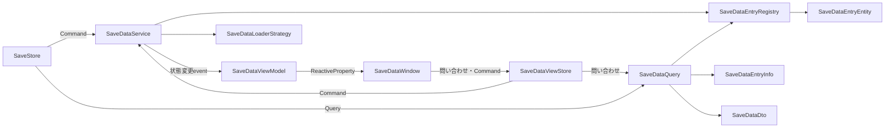

# Save Data System

保存したデータを型単位で読み込み、保持、保存、削除します。

## 入口

| 項目 | 内容 |
| --- | --- |
| namespace | `SymphonyFrameWork.System.SaveSystem` |
| 主な公開型 | `SaveStore` / `SaveDataContent` / `SaveDataLoaderStrategy` |
| メニューパス | `Project Settings > SymphonyFrameWork > Save System`、`Window > SymphonyFrameWork > Symphony Administrator` の `Save Data` パネル |
| 設定の保存先 | `Assets/Resources/SymphonyFrameWork/SaveDataConfig.asset` |

## クイックスタート

保存したいデータを`SaveDataContent`の派生classとして定義します。

```csharp
using System;
using SymphonyFrameWork.System.SaveSystem;

[Serializable]
public sealed class PlayerData : SaveDataContent
{
    public int Level = 1;
    public int Gold;
}
```

初回は`LoadAsync<T>()`で読み込み、戻り値のインスタンスを編集して保存します。

```csharp
PlayerData data = await SaveStore.LoadAsync<PlayerData>();
data.Gold += 100;

await SaveStore.SaveAsync<PlayerData>();
await SaveStore.DeleteAsync<PlayerData>();
```

読み込み済みであれば、同じインスタンスを`Get<T>()`で同期的に取り出せます。**`Get<T>()`は暗黙の読み込みを行いません。** 未読み込みの型を渡すと`InvalidOperationException`になります。非同期I/Oを行うローダーで暗黙の同期読み込みを許すと、待機を同期ブロックして完了不能になるためです。

```csharp
if (SaveStore.IsLoaded<PlayerData>())
{
    PlayerData cached = SaveStore.Get<PlayerData>();
}
```

既定ではJSONをPlayerPrefsへ保存します。別のシリアライザ、ファイル、クラウド等を使う場合は`SaveDataLoaderStrategy`を継承し、Project Settingsから選択します。

## 実装時の注意

- 保存型は`SaveDataContent`を継承した、デフォルトコンストラクタを持つ具象classにする。
- **旧`SaveDataRegistry`は3.0.0で削除済みである。** `SaveStore`を使う。
- **初回取得は`await SaveStore.LoadAsync<T>()`を使い、戻り値でインスタンスを受け取る。** `Get<T>()`は読み込み済みの値だけを返し、未読み込みなら`InvalidOperationException`を投げる。暗黙の同期読み込みは3.0.0で廃止した。
- `Get<T>()`を使う前に読み込み済みか分からない場合は`SaveStore.IsLoaded<T>()`で確認する。
- `SaveStore`が保持する型単位のキャッシュを編集する。別インスタンスとの二重管理を作らない。
- 保存先の失敗は`SaveDataOperationException`の`Operation`、`DataType`、`LoaderType`、`InnerException`で診断する。キャンセルは`OperationCanceledException`のまま伝播する。
- 独自`SaveDataLoaderStrategy`はProject Settingsの選択肢へ自動登録される。設定ScriptableObjectを手動生成しない。
- 独自ローダーが実装する`LoadJsonAsync`／`SaveJsonAsync`／`DeleteCoreAsync`は`Awaitable`を返す。同期的に完了する場合は`SymphonyAwaitable.Completed()`と`SymphonyAwaitable.FromResult(json)`を使い、`null`を返さない。
- キャッシュ済みの一覧は`SaveStore.GetEntries()`で取得する。型名の昇順で並んだ取得時点のスナップショットとして扱う。
- **`Data != null`を「読み込み済み」の判定に使わない。** キャッシュは初回アクセス時に既定値で作られるため、両者は別の状態である。読み込み済みかどうかは`SaveDataEntryInfo.IsLoaded`で判定する。

## Editor機能

### Save System設定

`SaveStore` が使用するセーブローダーを選択します。

**入口**: `Project Settings > SymphonyFrameWork > Save System`

| 項目 | 内容 |
| --- | --- |
| Loader | `SaveDataLoaderStrategy` を継承したローダー。`[SerializeReference]` で選択する |
| Current Loader Type | 現在設定されているローダーの型名（読み取り専用） |

**保存先**: `Assets/Resources/SymphonyFrameWork/SaveDataConfig.asset`

**注意点**:

- ローダーが未設定の場合、`SaveStore` は既定の `JsonUtility` ローダーへフォールバックします。警告が表示されます。
- **`SaveDataConfig` がまだ無い状態でこの画面を開いても、生成は始まりません。** 未生成である旨と `設定アセットを生成` ボタンが表示されます。設定アセットの生成はEditor起動時にまとめて行われる処理であり、画面を開いた副作用として走らせないためです。ボタンを押すと、起動時と同じ経路（`SymphonyEditorOrchestrator`）で生成されます。
- 独自ローダーは `SaveDataLoaderStrategy` を継承してください。共通の検証とデータ復旧は基底クラスが担当します。
- ローダーを変更すると、その場で `SaveStore` が読み直します。

### Save Data パネル

**入口**: `Window > SymphonyFrameWork > Symphony Administrator`

| パネル | 内容 |
| --- | --- |
| Save Data | 対応する全セーブデータ型、Inspectorの接続状態、保存状態 |

一覧から型を選ぶと、Inspectorのバインド元をランプで表示します。ランプは、Registry正本へ接続中なら緑、Window専用インスタンスへ保存値を読み込み済みなら黄、新規のWindow専用インスタンスなら赤、未選択なら消灯です。ロード中は赤のまま `Loading…` を表示し、完了までInspectorを編集できません。

| 操作 | 接続中（緑） | 非接続（黄・赤） |
| --- | --- | --- |
| Load | Registry正本を保存先から読み直す | Window専用インスタンスへ読み込む |
| Save | Registry正本を保存する | Window専用インスタンスを保存し、Registryへは登録しない |
| Delete | 保存値を削除してRegistry正本を既定値へ戻す | 保存値を削除してWindow専用インスタンスを作り直す |

非接続のInspectorを編集すると `未保存の変更あり` が表示されます。`Play Mode へ持ち越す` を有効にすると、Play Mode突入時にその内容を保存先へ書き出します。この設定は開発者ごとの `UserSettings/SymphonyFrameWork/SymphonyUserSettingConfig.asset` に保存され、既定は無効です。

## 内部構造

Save DataのRuntime内部も同じ形で、処理順、読み取り変換、表示状態を分離しています。



`SaveDataQuery`だけがRegistry／Entityを読み取り、利用側には`SaveDataEntryInfo`、Viewには内部Dtoを返します。`SaveDataWindow`は表示状態を`SaveDataViewModel`から購読し、操作と問い合わせは`SaveDataViewStore`へ送ります。状態が変わったときにバインド元を評価し、解決した状態が変わった場合、または接続中のRegistry正本が差し替わった場合だけInspectorを再バインドします。

`SaveDataViewStore`は表示状態を持たず、問い合わせをQueryへ、CommandをServiceへ委譲します。Window専用インスタンスのLoad／Save／DeleteはServiceのdetached操作へ渡され、通常操作と同じLoaderと例外変換を使いますが、Registryを読み書きせず、状態変更eventも発行しません。

永続化データが存在するかどうか（`Exists`）はQueryに含めません。ローダーへのI/Oであり、状態が変わるたびに全型分の問い合わせが走るためです。

## 関連

- [Utility](./Utility.md)
- [Architecture.md](../Architecture.md)
- [Deprecations.md](../Deprecations.md)
- [CHANGELOG.md](../../CHANGELOG.md)
