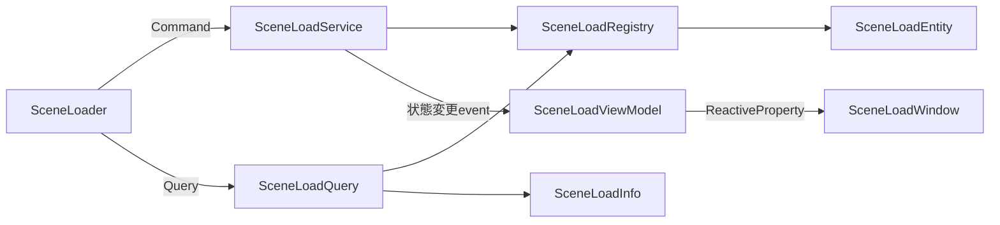

# Scene Loader

Scene Loaderは非同期ロード、進捗、複数シーン、優先度によるActive Scene切り替えをまとめて扱います。

## 入口

| 項目 | 内容 |
| --- | --- |
| namespace | `SymphonyFrameWork.System.SceneLoad` |
| 主な公開型 | `SceneLoader` / `SceneLoadRequest` / `SceneLoadInfo` / `IInitializeAsync` |
| メニューパス | `Window > SymphonyFrameWork > Symphony Administrator` の `Scene Load` パネル |
| 設定の保存先 | `Assets/Resources/SymphonyFrameWork/SceneLoadConfig.asset` |

## クイックスタート

対象シーンをBuild Settingsへ追加してから、名前を指定してロードします。

```csharp
using System;
using SymphonyFrameWork.System.SceneLoad;
using UnityEngine;
using UnityEngine.SceneManagement;

public async void OpenGameScene()
{
    var request = new SceneLoadRequest("Game", priority: 10);
    IProgress<float> progress = new Progress<float>(
        value => Debug.Log($"Loading: {value:P0}"));

    bool succeeded = await SceneLoader.LoadSceneAsync(
        request,
        progress,
        mode: LoadSceneMode.Additive,
        token: destroyCancellationToken);

    if (succeeded)
    {
        SceneLoader.SetActiveScene("Game");
    }
}
```

`SceneLoadRequest`はシーン名とActive Scene選択用の優先度を1つの値として扱います。複数シーンでは`SceneLoadRequest[]`を`LoadScenesAsync`へ渡せるため、シーン名と優先度の対応を崩しません。進捗の推奨契約は`IProgress<float>`です。既存のシーン名と`Action<float>`を使うoverloadも互換性のため利用できます。

追跡中の全シーンは、変更不能な`SceneLoadInfo`のスナップショットとして取得できます。取得後にロード状態が変わっても、既に取得した値は変化しません。

```csharp
foreach (SceneLoadInfo sceneInfo in SceneLoader.GetSceneInfos())
{
    Debug.Log(
        $"{sceneInfo.SceneName}: {sceneInfo.State}, "
        + $"Priority={sceneInfo.Priority}, Progress={sceneInfo.Progress:P0}, "
        + $"Active={sceneInfo.IsActive}");
}

if (SceneLoader.TryGetSceneInfo("Game", out SceneLoadInfo gameScene))
{
    Debug.Log($"Game scene progress: {gameScene.Progress:P0}");
}
```

ルートGameObjectが`IInjectable<T...>`や`IInitializeAsync`を実装している場合は、注入と初期化の完了も待機します。

## 実装時の注意

- 対象シーンがBuild SettingsのScene Listにあることを、シーン名をコードへ書く前に確認する。
- シーン遷移は原則`SceneLoader`を使う。`SceneManager.LoadScene`を直接使うと、優先度管理、依存注入、`IInitializeAsync`が働かない。
- `LoadSceneMode.Single`は対象をAdditiveでロードした後、他の追跡シーンをアンロードする。現在のシーンを残す場合は`Additive`を使う。
- 依存注入または`IInitializeAsync`の失敗は`SceneInitializationException`。Build Settings未登録など通常のロード失敗はfalseで返る。
- 追跡中のScene名が分からない状態で一覧を調べる場合は`SceneLoader.GetSceneInfos()`を使う。既知のScene名だけを調べる場合は`TryGetSceneInfo`を使い、戻る`SceneLoadInfo`を取得時点のスナップショットとして扱う。

## Editor機能

**入口**: `Window > SymphonyFrameWork > Symphony Administrator`

| パネル | 内容 |
| --- | --- |
| Scene Load | ロード済みシーンと進行中のロード |

Play Mode中のみ内容を持ちます。Edit Modeでは未接続状態を表示します。

## 内部構造

Scene Loadの内部では、Commandと読み取りを分離しています。



`SceneLoadQuery`だけがRegistry／Entityを読み取り、利用側には`SceneLoadInfo`、Viewには内部Dtoを返します。`SceneLoadWindow`はViewModelを購読し、RuntimeのRegistryやEntityを直接参照しません。

## 関連

- [Service Locator](./ServiceLocator.md)
- [Architecture.md](../Architecture.md)
- [Deprecations.md](../Deprecations.md)
- [CHANGELOG.md](../../CHANGELOG.md)
