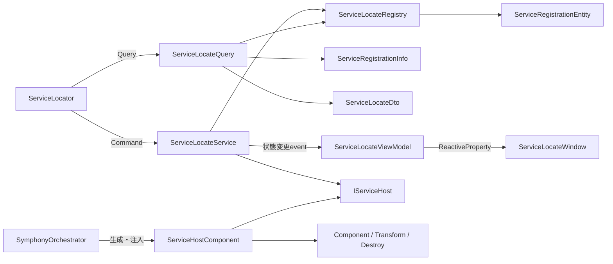

# Service Locator

共有したいインスタンスを登録し、必要な場所から型で取得します。

## 入口

| 項目 | 内容 |
| --- | --- |
| namespace | `SymphonyFrameWork.System.ServiceLocate` |
| 主な公開型 | `ServiceLocator` / `ServiceInjector` / `ServiceLocateComponent` / `IInjectable` / `LocateTypeEnum` / `ServiceRegistrationInfo` |
| メニューパス | `Window > SymphonyFrameWork > Symphony Administrator` の `Service Locate` パネル |
| 設定の保存先 | `UserSettings/SymphonyFrameWork/SymphonyUserSettingConfig.asset`（Service Locatorのログ設定） |

## クイックスタート

```csharp
using SymphonyFrameWork.System.ServiceLocate;
using UnityEngine;

public sealed class GameSession : MonoBehaviour
{
    private void OnEnable()
    {
        ServiceLocator.RegisterInstance(this, LocateTypeEnum.Locator);
    }

    private void OnDisable()
    {
        ServiceLocator.UnregisterInstance(this);
    }
}
```

```csharp
GameSession session = ServiceLocator.GetRequiredInstance<GameSession>();
GameSession awaited = await ServiceLocator.GetInstanceAsync<GameSession>(
    grace: 10,
    token: destroyCancellationToken);
```

`Locator`は参照だけを登録し、`Singleton`はComponentを永続管理オブジェクト配下へ移動します。GameObjectへ`ServiceLocateComponent`を追加してInspectorから登録することもできます。

通常の`RegisterInstance`が型重複で`false`を返した場合、渡した候補の所有権は呼び出し側に残ります。重複した新規候補を以後使わず、自動的に`Dispose`またはGameObject破棄してよい場合だけ、所有権移譲を明示する`RegisterInstanceWithAutoDispose`を使います。

```csharp
ServiceLocator.RegisterInstanceWithAutoDispose(
    newSession,
    LocateTypeEnum.Singleton);
```

登録中の型、payload、登録方式を一覧で診断する場合は、取得時点の不変な`ServiceRegistrationInfo`を使います。既知の型だけを調べる場合は`TryGetRegistrationInfo`を使えます。

```csharp
foreach (ServiceRegistrationInfo registration
         in ServiceLocator.GetRegistrationInfos())
{
    Debug.Log(
        $"{registration.ServiceType.Name}: {registration.LocateType}");
}
```

シーンロード時の自動注入には`IInjectable<T...>`、実行時に生成したオブジェクトへの手動注入には`ServiceInjector.Inject(...)`を使います。

## 実装時の注意

- 登録と解除を同じライフサイクルの対として書く。基本形は`OnEnable`で`RegisterInstance`、`OnDisable`で`UnregisterInstance`。
- 解除と照会（`UnregisterInstance`、`DestroyInstance`、`IsExistInstance`、`GetInstance`、`TryGetInstance`、`GetRegistrationInfos`、`TryGetRegistrationInfo`）は、Play Mode終了でLocatorが解放された後でも安全なno-opとして`false`／`null`／空一覧を返す。`OnDestroy`や`OnDisable`で初期化状態を確認する必要はない。登録（`RegisterInstance`系）、`GetRequiredInstance`、待機（`GetInstanceAsync`、`TryGetInstanceAsync`、`RegisterAfterLocate`）は未初期化で`SymphonyNotInitializedException`を投げる。
- 通常の`RegisterInstance`がfalseの場合も候補の所有権は呼び出し側に残る。型重複時に候補を自動解放してよい場合だけ`RegisterInstanceWithAutoDispose`へ所有権を移す。
- `LocateTypeEnum.Locator`は参照だけを登録する。`LocateTypeEnum.Singleton`はComponentを管理オブジェクト配下へ移動するため、シーンローカルなオブジェクトには使わない。
- 任意依存は`TryGetInstance<T>`、nullを許容する既存コードは`GetInstance<T>`、必須依存は`GetRequiredInstance<T>`を使う。
- 登録中の型と登録方式を一覧で調べる場合は`GetRegistrationInfos()`、既知の型だけを調べる場合は`TryGetRegistrationInfo(Type, out ...)`を使う。返る`ServiceRegistrationInfo`は取得時点のスナップショットとして扱う。
- `GetInstanceAsync<T>`の期限超過は`TimeoutException`、呼び出し側キャンセルは`OperationCanceledException`。`TryGetInstanceAsync<T>`がfalseへ変換するのは期限超過だけ。
- `SceneLoader`が自動注入するのはロードしたシーンのルートにある`IInjectable<T...>`。実行時`Instantiate`したオブジェクトには`ServiceInjector.Inject(...)`を手動で呼ぶ。

## Editor機能

### Service Locate パネル

**入口**: `Window > SymphonyFrameWork > Symphony Administrator`

| パネル | 内容 |
| --- | --- |
| Service Locate | 登録済みインスタンスの一覧と登録状態 |

Play Mode中のみ内容を持ちます。Edit Modeでは未接続状態を表示します。

### ログ設定

**入口**: `Project Settings > SymphonyFrameWork`

| 項目 | 内容 |
| --- | --- |
| Set Instance | インスタンスの登録ログを出力するか |
| Get Instance | インスタンスの取得ログを出力するか |
| Destroy Instance | インスタンスの破棄ログを出力するか |

**保存先**: `UserSettings/SymphonyFrameWork/SymphonyUserSettingConfig.asset`

**注意点**:

- `UserSettings/` は開発者ごとの設定です。**版管理へ含めないでください。** 他の開発者のログ設定を上書きします。

## 内部構造

Service LocateのRuntime内部では、登録Command、読み取り変換、表示状態、Unity所有処理を分離しています。



`ServiceLocateQuery`だけがRegistry／Entityを読み取り、利用側には`ServiceRegistrationInfo`、Viewには内部Dtoを返します。`ServiceLocateWindow`はViewModelを購読し、登録状態が変わったときだけ再描画します。

通常登録が型重複で失敗しても候補payloadを解放しません。`RegisterInstanceWithAutoDispose`を選んだ場合だけ、失敗した候補を`ServiceHostComponent`が`IDisposable`またはComponentとして解放します。RegistryとEntityはUnity APIを参照しません。

## 関連

- [Scene Loader](./SceneLoader.md)
- [Architecture.md](../Architecture.md)
- [Deprecations.md](../Deprecations.md)
- [CHANGELOG.md](../../CHANGELOG.md)
